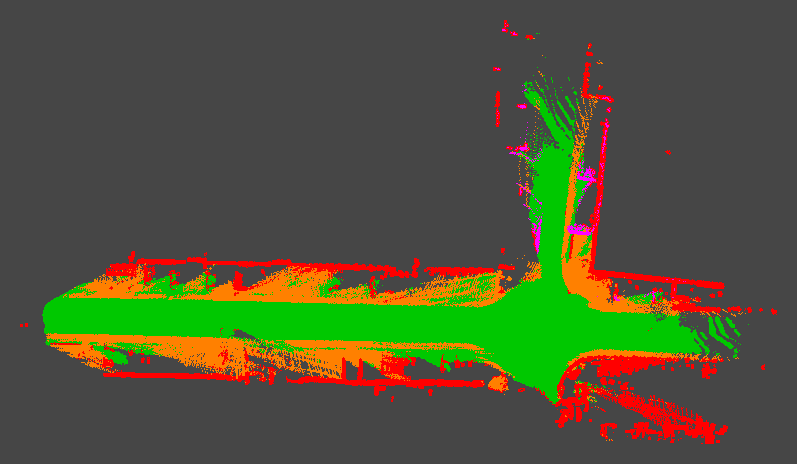

# Semantic Mapping from Camera and LiDAR

A camera-LiDAR perception pipeline that builds persistent semantic maps of
drivable space and obstacles from recorded driving data.

## What it does

The system processes each driving frame through four stages:

1. A compact U-Net predicts a semantic class for each camera pixel.
2. Camera calibration projects LiDAR points into the image.
3. Each visible LiDAR point receives a semantic label and confidence score.
4. Pose-aligned frame grids are accumulated into a persistent map.

The camera provides semantic meaning, LiDAR provides metric 3D geometry, and
recorded vehicle poses place observations into a shared map frame.



## Pipeline

```text
RGB image
   ↓
U-Net semantic segmentation
   ↓
Camera–LiDAR calibration
   ↓
Semantic 3D point painting
   ↓
Frame-level semantic grid
   ↓
Pose-aligned map accumulation
   ↓
Persistent semantic map
```

The five classes are `drivable`, `non_drivable`, `static_obstacle`,
`dynamic_obstacle`, and `background`.

## Results

The epoch-29 checkpoint was trained on A2D2 and achieved:

- **79.7% test navigation mIoU**;
- **83.1% test all-class mIoU**;
- **0.69 FPS** for a 200-frame CPU playback using every third frame;
- approximately **1.45 seconds per processed frame** end to end on CPU.

## Demo

Activate the environment and run the long sequential playback:

```bash
cd ~/projects/semantic-costmap-cv-model
source .venv/bin/activate
export PYTHONPATH=src

python tools/run_playback.py --device cpu
```

The default demo uses the 600-frame sequential A2D2 playback, processes 200
frames with stride 3, and creates a 10 FPS GIF. The persistent map window is
200 m in each direction so the longer trajectory is not clipped. Results are
written to:

```text
outputs/playback/semantic_costmap_playback.gif
outputs/playback/benchmark.json
```

To accumulate a persistent map, provide a pose CSV:

```bash
python tools/run_playback.py \
  --device cpu \
  --poses-csv outputs/poses/poses.csv \
  --output-dir outputs/mapping_demo
```

This additionally saves the accumulated semantic map, confidence map, and
trajectory preview.

For a reusable command with your own synchronized frame folders:

```bash
python tools/semantic_map.py \
  --camera-dir path/to/camera_frames \
  --lidar-dir path/to/lidar_frames \
  --poses-csv path/to/poses.csv \
  --output-dir outputs/my_map
```

For a camera-only video, the wrapper writes a semantic overlay and confidence
panel to an MP4. It does not create a 3D map without LiDAR:

```bash
python tools/semantic_map.py \
  --video path/to/drive.mp4 \
  --output-dir outputs/video_demo
```

## Setup

Create the Python environment and install the project:

```bash
python3 -m venv .venv
source .venv/bin/activate
python -m pip install -e ".[dev]"
```

Place the trained checkpoint at:

```text
outputs/checkpoints/epoch29_restore/best_semantic_unet.pt
```

The long demo expects paired files at:

```text
data/raw/sequential_playback/camera/*.png
data/raw/sequential_playback/lidar/*.npz
```

Single-frame tools use samples under `data/raw/a2d2_sample/`.

## Repository structure

```text
configs/                 Calibration and class definitions
src/semantic_costmap/    Model, geometry, fusion, grids, and mapping
tools/                   Inference, playback, pose, and visualization commands
tests/                   Python unit and integration tests
docs/                    Short design and usage notes
data/                    Local datasets, ignored by Git
outputs/                 Checkpoints and generated artifacts, ignored by Git
```
